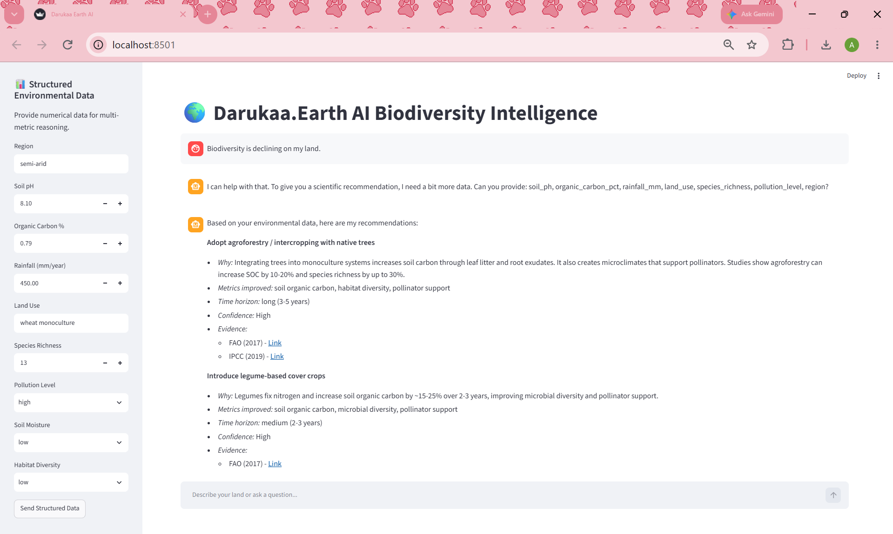

# Darukaa.Earth: AI Biodiversity Intelligence Chatbot

An AI-powered conversational environmental scientist designed to generate evidence-backed, multi-metric recommendations for improving biodiversity. This system moves beyond generic LLM responses by utilizing a hybrid knowledge layer (RAG + Structured SQL) and a rule-based multi-metric reasoning engine.

## 🚀 Live Demo
You can try the live application here:
- **Frontend (Streamlit):** [https://darukaa-earth-ai-jmtzbpwtwnrg6nhtfgqhds.streamlit.app/](https://darukaa-earth-ai-jmtzbpwtwnrg6nhtfgqhds.streamlit.app/)
- **Backend API (Render):** [https://darukaa-earth-ai-ms98.onrender.com](https://darukaa-earth-ai-ms98.onrender.com)

## 📸 Demo Screenshot



## ✨ Key Features
- **Hybrid Knowledge Retrieval:** Combines document retrieval (RAG) with a structured SQLite database.
- **Multi-Metric Reasoning:** Connects at least 3 environmental variables per recommendation (e.g., Soil pH + Land Use + Rainfall).
- **Slot-Filling Conversational Memory:** Asks clarifying questions when data is missing and remembers context across multiple turns.
- **Evidence-Backed Output:** Every recommendation includes measurable impact estimates, time horizon, and citations (FAO, IPCC, IPBES).

## 🏗️ System Architecture
The system is built on a modular architecture to ensure clear separation of concerns:

1. **Frontend (Streamlit):** Provides a chat interface for text queries and a sidebar for structured environmental data input.
2. **Backend (FastAPI):** Handles API routing, manages conversational memory, and orchestrates the reasoning pipeline.
3. **Hybrid Knowledge Layer:**
   - **Unstructured (RAG):** Retrieves relevant scientific context from a document corpus.
   - **Structured (SQL):** A SQLite database (`sites.db`) storing numerical environmental metrics (soil pH, organic carbon, rainfall, land use, species richness).
4. **Reasoning Engine:** A Python-based rule engine that generates non-obvious, scientifically grounded advice.
5. **Data Ingestion Pipeline:** Scripts to fetch real geospatial soil data (SoilGrids API), seed the structured database, and ingest scientific PDFs into the vector database.

## ⚙️ Deployment Notes & Architectural Adaptations

To provide a fully functional live demo on free-tier hosting and comply with GitHub's limits, the following engineering adaptations were made:

1. **GitHub File Size Limit (HTTP 408 Timeout):**
   - **Problem:** The original collection of FAO, IPCC, and IPBES PDFs totaled over 126 MB, causing GitHub to reject the push.
   - **Solution:** The raw PDFs were excluded from the repository via `.gitignore`. Instead, a lightweight `sample.txt` was used for the live RAG demonstration. The full dataset is hosted externally on Google Drive (link below).
   
2. **Render Free Tier Memory Limit (502 Bad Gateway Error):**
   - **Problem:** The live backend initially used `sentence-transformers` (PyTorch) for embeddings. This exceeded Render's 512 MB RAM limit, causing the server to crash (502 errors) on every request.
   - **Solution:** The live deployment was refactored to use a lightweight **TF-IDF vectorizer** (`scikit-learn`). This eliminates heavy ML model loading, keeps memory usage under 100 MB, and ensures the RAG pipeline remains functional on the live demo. The full `sentence-transformers` pipeline is still available for local execution.

## 🗄️ Database Schema
The structured data is stored in SQLite (`db/schema.sql`). Key tables include:
- `sites`: Stores environmental metrics (`soil_ph`, `organic_carbon_pct`, `rainfall_mm`, `land_use`, `species_richness`, `region`, etc.).
- `documents`: Stores metadata for indexed scientific reports.
- `recommendations`: Logs generated recommendations for auditing.

## 💻 Tech Stack
- **Language:** Python 3.11
- **Backend:** FastAPI, Uvicorn
- **Frontend:** Streamlit
- **RAG Engine:** TF-IDF (Scikit-Learn) for live deployment, ChromaDB for local deployment
- **Database:** SQLite
- **CI/CD:** GitHub Actions

## 🚀 Local Setup Instructions
Follow these steps to run the project locally:

1. **Clone the repository:**
   ```bash
   git clone https://github.com/AnushkaPathak2712/darukaa-earth-ai.git
   cd darukaa-earth-ai

2.**Create and activate a virtual environment:**

bash
python -m venv venv
# Windows:
venv\Scripts\activate
# Mac/Linux:
source venv/bin/activate
Install dependencies:

bash
pip install -r requirements.txt

3.**Fetch real soil data and seed the database:**

bash
python fetch_soil.py
python db/seed.py

4.**Ingest scientific PDFs into the knowledge base:**
Place your downloaded PDFs inside the data/documents/ folder first.

bash
python rag/ingest.py
Run the Backend API (Terminal 1):

bash
uvicorn main:app --reload
Run the Frontend UI (Terminal 2):

bash
streamlit run app.py

5.**Open your browser to the URL provided by Streamlit (usually http://localhost:8501).**

📂 Original PDF Dataset
Due to GitHub's file size limits, the raw PDF documents (FAO, IPCC, IPBES) could not be included in this repository. You can download the full PDF dataset here:
Download PDFs from Google Drive-
https://drive.google.com/drive/folders/14uuKJxA3rQgdSFHA0zQnpF3UqbtOWCyb?usp=sharing


To use them, simply place the downloaded PDFs into the data/documents/ folder and run python rag/ingest.py as per the local setup instructions.

📝 Notes on Data Sourcing
Since the hackathon did not provide a proprietary dataset, this system was designed with a plug-and-play architecture. The knowledge base was populated using publicly available scientific reports from the FAO, IPCC, and IPBES, and real geospatial soil data was fetched using the ISRIC SoilGrids API.

🔄 CI/CD Details
This repository uses GitHub Actions for Continuous Integration.

The workflow is defined in .github/workflows/ci.yml.

On every push or pull request to the main branch, the action will:

Set up a Python 3.11 environment.
Install all dependencies from requirements.txt.
Verify that all Python files compile successfully.